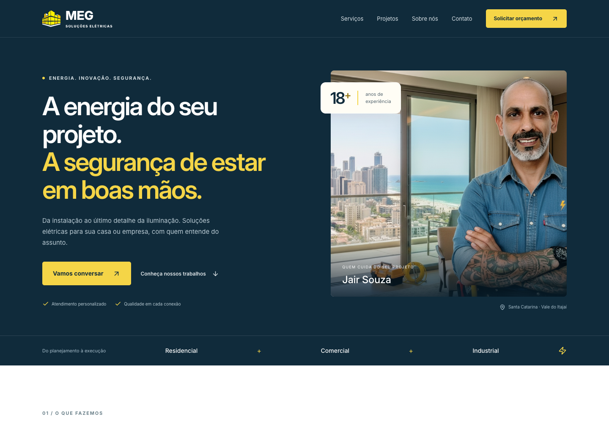
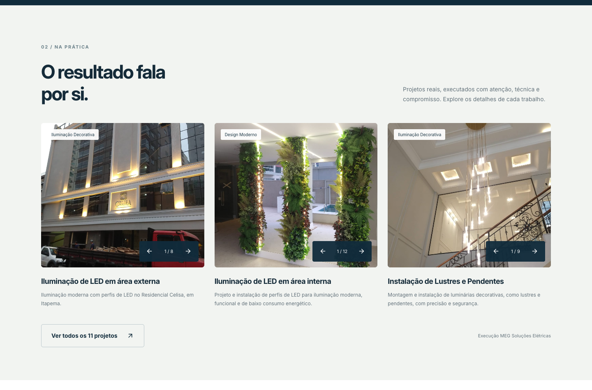

<div align="center">


# MEG Soluções Elétricas

**Energia para transformar. Segurança para confiar.**

Landing page institucional para apresentar os serviços, valorizar os projetos realizados e facilitar o contato com Jair Souza, profissional responsável pela MEG no Vale do Itajaí, em Santa Catarina.

[Visitar o site](https://megsolucoeseletricas.com.br/) · [Prévia do projeto](#prévia-do-projeto) · [Executar localmente](#executar-localmente)

**React 18 · TypeScript · Vite 7 · CSS responsivo**

</div>

## Sobre o projeto

A página reúne apresentação profissional, catálogo de serviços, portfólio e solicitação de orçamento em uma experiência contínua. A identidade visual combina azul profundo, amarelo e fotografias dos trabalhos, com hierarquia de conteúdo e chamadas de contato claras.

O projeto utiliza React e Vite, com navegação por âncoras e CSS próprio. A estrutura enxuta facilita a manutenção dos textos, das imagens e dos dados de contato, sem depender de um roteador ou de uma biblioteca completa de componentes.

## Prévia do projeto

Capturas reais da versão local, com o layout padrão e sem dados de clientes. As imagens estão versionadas em [`docs/images/`](docs/images/).

### Desktop

Abertura da página em uma janela de **1440 × 1000 px**.



### Portfólio

Seção de projetos capturada em uma janela de **1440 px de largura**, com as fotografias carregadas.



### Celular

Navegação compacta e conteúdo reorganizado em uma janela de **390 × 1100 px**.

<p align="center">
  
</p>

## Funcionalidades

- **Apresentação profissional:** proposta de valor, experiência de Jair Souza e região de atendimento.
- **Catálogo de serviços:** oito categorias, incluindo instalações, iluminação, manutenção, proteção, infraestrutura, redes e emergências.
- **Portfólio navegável:** três projetos em destaque e expansão para os 11 projetos cadastrados, com controles individuais para navegar pelas fotos.
- **Contato direto:** links para WhatsApp, telefone e e-mail, além do formulário de orçamento integrado ao EmailJS.
- **Formulário com feedback:** validação dos campos, bloqueio durante o envio e mensagens de sucesso ou erro. Em caso de falha, os dados permanecem preenchidos.
- **Navegação responsiva:** menu móvel, âncoras entre seções e botão flutuante de retorno ao início, exibido quando o rodapé entra na tela.
- **Carregamento de imagens:** prioridade para a foto principal e carregamento adiado nas demais seções. Cada galeria monta apenas a foto selecionada.
- **SEO e compartilhamento:** metadados no HTML, URL canônica, Open Graph, Twitter Card, dados estruturados, sitemap e robots.txt.

## Tecnologias

| Tecnologia     | Papel no projeto                                 |
| -------------- | ------------------------------------------------ |
| React 18       | Componentes e estados da interface               |
| TypeScript     | Tipagem e verificação do código                  |
| Vite 7 + SWC   | Servidor de desenvolvimento e build de produção  |
| CSS            | Identidade visual, layouts fluidos e breakpoints |
| Lucide React   | Ícones da interface                              |
| EmailJS        | Envio das solicitações de orçamento              |
| ESLint         | Análise estática do código                       |
| GitHub Actions | Automação do build e da publicação na Hostinger  |

## Executar localmente

**Pré-requisitos:** Node.js 20.19+ na linha 20, ou Node.js 22.12+; npm e Git instalados.

```sh
git clone https://github.com/elianoliver/Meg-Solucoes-Eletricas.git
cd Meg-Solucoes-Eletricas
npm ci
npm run dev
```

Abra o endereço informado pelo Vite no terminal, normalmente `http://localhost:5173`.

### Comandos disponíveis

| Comando           | Descrição                                                     |
| ----------------- | ------------------------------------------------------------- |
| `npm run dev`     | Inicia o servidor de desenvolvimento                          |
| `npm run lint`    | Analisa o código com ESLint                                   |
| `npm run build`   | Verifica TypeScript e gera os arquivos de produção em `dist/` |
| `npm run preview` | Serve o build localmente para revisão; execute o build antes  |

## Estrutura do repositório

```text
├── .github/workflows/deploy.yml  # Publicação na Hostinger
├── docs/images/                  # Capturas utilizadas neste README
├── public/                       # Logo, favicon, SEO e verificação do Google
├── src/
│   ├── assets/
│   │   ├── jair2.png             # Foto do profissional
│   │   └── services/             # Fotografias organizadas por projeto
│   ├── components/              # Seções da página e formulário
│   ├── App.tsx                  # Composição da landing page
│   ├── contact.ts               # Canais de contato centralizados
│   ├── projects.ts              # Títulos, descrições e categorias dos projetos
│   ├── index.css                # Estilos e regras responsivas
│   └── main.tsx                 # Entrada da aplicação React
├── .env.example                 # Exemplo de configuração do EmailJS
├── index.html                   # HTML, metadados e dados estruturados
├── package.json                 # Dependências e scripts
└── vite.config.ts               # Configuração do Vite
```

## Personalização e manutenção

| Alteração                                      | Arquivo ou diretório                                                 |
| ---------------------------------------------- | -------------------------------------------------------------------- |
| Telefone, e-mail e mensagem do WhatsApp        | `src/contact.ts`                                                     |
| Textos e categorias dos projetos               | `src/projects.ts`                                                    |
| Fotos dos projetos                             | `src/assets/services/`                                               |
| Lista de serviços                              | `src/components/ServicesSection.tsx`                                 |
| Apresentação e informações do profissional     | `src/components/HeroSection.tsx` e `src/components/AboutSection.tsx` |
| Cores, espaçamentos e comportamento responsivo | `src/index.css`                                                      |
| SEO, endereço do site e dados da empresa       | `index.html`, `public/sitemap.xml` e `public/robots.txt`             |

Para adicionar um projeto, crie uma pasta em `src/assets/services/` com imagens `.jpg` e cadastre a mesma chave em `src/projects.ts`. A galeria associa as imagens pelo nome da pasta. Use nomes de arquivo em ordem numérica para controlar a sequência das fotos.

Ao alterar os contatos, atualize também os dados estruturados de `index.html`. Quando modificar o design, renove as três capturas em `docs/images/`, mantendo os nomes para preservar os links deste README.

### Configurar o formulário

Copie o exemplo para um arquivo de configuração local:

```sh
cp .env.example .env.local
```

Preencha os identificadores da conta EmailJS:

```dotenv
VITE_EMAILJS_SERVICE_ID=seu_service_id
VITE_EMAILJS_TEMPLATE_ID=seu_template_id
VITE_EMAILJS_PUBLIC_KEY=sua_chave_publica
```

O template deve receber os campos `name`, `phone`, `reply_to`, `service_type` e `message`. Configure as origens permitidas no painel do EmailJS e reinicie o servidor após alterar as variáveis. Sem substituições, o formulário utiliza os identificadores públicos existentes no código.

As variáveis `VITE_*` são incluídas no código enviado ao navegador: utilize apenas identificadores e chaves públicas. O arquivo `.env.local` é ignorado pelo Git. Para alterar os valores na publicação automatizada, disponibilize as variáveis no ambiente de build do GitHub Actions.

## Responsividade e acessibilidade

O layout usa contêineres fluidos e ajustes em 1100, 760 e 390 px, além de espaçamento específico para telas amplas. A interface foi verificada em larguras de **320 a 1920 px**, sem rolagem horizontal nos cenários testados.

A navegação oferece link para pular ao conteúdo, foco visível, menu com `aria-expanded` e fechamento por Escape. O formulário possui rótulos associados aos campos e mensagens de estado anunciáveis. Os controles de galeria têm nomes acessíveis, e a rolagem respeita a preferência por movimento reduzido.

### Verificação antes de publicar

```sh
npm run lint
npm run build
npm run preview
```

Na prévia, confira o menu móvel, as âncoras, a navegação pelas fotos, a expansão do portfólio e o botão de retorno ao início. Os estados de sucesso e erro do formulário foram verificados com respostas simuladas; a entrega real depende da configuração do EmailJS e deve ser conferida separadamente.

## Publicação

O workflow [`deploy.yml`](.github/workflows/deploy.yml) é executado após um push na branch `main`. Ele instala as dependências, gera `dist/` e envia os arquivos à Hostinger via FTP.

A publicação utiliza os secrets `FTP_SERVER`, `FTP_USERNAME` e `FTP_PASSWORD` configurados no repositório. O workflow atual usa `dangerous-clean-slate: true`, que limpa o diretório remoto de destino antes do envio; esse destino deve ser exclusivo do site.

Acompanhe as execuções em [GitHub Actions](https://github.com/elianoliver/Meg-Solucoes-Eletricas/actions).

## Autoria e licença

Desenvolvido por [Elian Oliver](https://www.elian.dev.br/) para **MEG Soluções Elétricas**.

Este projeto é proprietário. Todos os direitos reservados à MEG Soluções Elétricas, conforme o arquivo [LICENSE](LICENSE).
